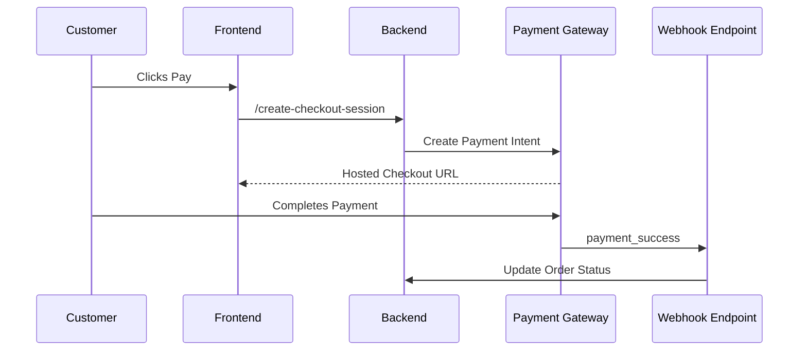

# Payment Gateway Integration API Documentation (e.g., Razorpay, Stripe)

## 1. Introduction

### Overview  
The **Payment Gateway Integration API** allows your application to connect with external payment providers like **Stripe** or **Razorpay** to securely handle transactions, process customer payments, and manage payment-related events such as refunds, verifications, and webhook notifications.

### Why It Matters  
Secure and seamless payment processing is critical for any digital commerce system. A robust integration ensures smooth customer experience, reduces payment failures, and complies with security and regulatory standards (e.g., PCI DSS).

### Who This Guide is For  
- Backend developers integrating payment flows  
- Frontend developers implementing checkout interfaces  
- Security engineers validating PCI compliance  
- Product teams enabling subscription or one-time payments  
- Finance/operations staff managing refunds and reconciliation

---

## 2. Key Terminology

- **Payment Intent**: (Stripe) An object representing the lifecycle of a payment  
- **Order ID**: A unique reference to the order being paid for  
- **Checkout Session**: A hosted payment page session (Stripe/Razorpay Checkout)  
- **Webhook**: An HTTP callback sent by the gateway to notify of payment events  
- **Capture**: The process of finalizing a previously authorized payment  
- **Refund**: Returning the amount to the customer post-purchase  
- **Tokenization**: Encrypting payment info for secure, one-time or repeat use  
- **PCI DSS**: Payment Card Industry Data Security Standard for compliance  

---

## 3. Technical Overview

### Architecture Flow

Your backend acts as a secure intermediary between the frontend and the payment gateway. It creates the transaction, verifies the status via webhooks, and updates your order system accordingly.

Supported Gateways
Stripe: Global gateway with support for cards, wallets, and bank debits

Razorpay: Popular in India; supports UPI, cards, wallets, and EMI

Backend Tools
Stripe SDKs: https://stripe.com/docs

Razorpay SDKs: https://razorpay.com/docs/

Node.js / Django / Spring Boot: For secure backend logic

HTTPS & SSL: All webhook endpoints must be served over TLS

4. Step-by-Step Guide or Workflow
4.1 Create a Checkout Session (Backend)
Stripe Example:
http
Copy
Edit
POST /api/payments/stripe/checkout
Backend Logic (Node.js):

js
Copy
Edit
const stripe = require('stripe')('sk_test_...');
const session = await stripe.checkout.sessions.create({
  payment_method_types: ['card'],
  line_items: [{
    price_data: {
      currency: 'usd',
      product_data: {
        name: 'Wireless Mouse',
      },
      unit_amount: 2500,
    },
    quantity: 1,
  }],
  mode: 'payment',
  success_url: 'https://yourdomain.com/success',
  cancel_url: 'https://yourdomain.com/cancel',
});
Response:

json
Copy
Edit
{
  "checkout_url": "https://checkout.stripe.com/pay/cs_test_..."
}
4.2 Handle Webhooks
You must configure a webhook to listen for payment success/failure.

http
Copy
Edit
POST /api/webhooks/stripe
Payload Example (payment success):

json
Copy
Edit
{
  "type": "checkout.session.completed",
  "data": {
    "object": {
      "payment_intent": "pi_123",
      "customer_email": "user@example.com"
    }
  }
}
Action: Update order status in your database to paid.

4.3 Verify Payment (Optional Manual Check)
http
Copy
Edit
GET /api/payments/stripe/status/:payment_intent_id
4.4 Issue a Refund (Backend)
js
Copy
Edit
const refund = await stripe.refunds.create({
  payment_intent: 'pi_123',
});
4.5 Razorpay Example (Payment Capture)
Razorpay requires capturing payments after order creation.

js
Copy
Edit
const razorpay = new Razorpay({ key_id: 'rzp_test...', key_secret: '...' });

const order = await razorpay.orders.create({
  amount: 50000, // in paise
  currency: "INR",
  receipt: "order_rcptid_11",
  payment_capture: 1
});
Frontend Integration:

html
Copy
Edit

5. Best Practices
Use HTTPS Everywhere: Especially for webhooks and callbacks

Never Handle Card Details Directly: Use gateway’s secure UI or SDK

Store Transaction IDs: For auditing and reconciliation

Validate Webhooks with Signature Secret: To prevent spoofing

Use Idempotent Requests: Avoid duplicate charges on retries

Separate Sandbox and Production Keys: Avoid accidental live charges

Notify Users Post-Payment: Confirmation emails or receipts

6. Common Issues & Troubleshooting
Issue	Description	Resolution
400 Bad Request	Invalid parameters	Double-check the request structure
402 Payment Required	Card declined	Inform user and retry with another method
403 Forbidden	Using test keys in prod	Replace keys with live credentials
409 Conflict	Payment already captured	Use idempotency keys
Signature Mismatch	Webhook spoofing	Check secret used to verify webhook signature

7. References
Stripe API Docs

Razorpay Integration Docs

PCI Compliance Guide

OAuth for Secure Auth

Handling Webhooks Securely

8. Appendix
Sample Webhook Verification (Stripe, Node.js)
js
Copy
Edit
const endpointSecret = "whsec_...";
const sig = req.headers['stripe-signature'];

let event;
try {
  event = stripe.webhooks.constructEvent(req.body, sig, endpointSecret);
} catch (err) {
  return res.status(400).send(`Webhook Error: ${err.message}`);
}
Mermaid Flow: Razorpay Payment Process
mermaid
Copy
Edit
graph TD
    A[User Checkout] --> B[Backend Creates Razorpay Order]
    B --> C[Returns Order ID]
    C --> D[Frontend Razorpay Checkout.js]
    D --> E[Payment Gateway UI]
    E --> F[Razorpay Verifies & Captures Payment]
    F --> G[Webhook Notifies Server]
    G --> H[Update Order as Paid]
Curl Example: Stripe Checkout Session
bash
Copy
Edit
curl -X POST https://api.yoursite.com/api/payments/stripe/checkout \
  -H "Authorization: Bearer <your_token>" \
  -H "Content-Type: application/json" \
  -d '{
    "order_id": "ORD123",
    "amount": 5000,
    "currency": "usd"
  }'
